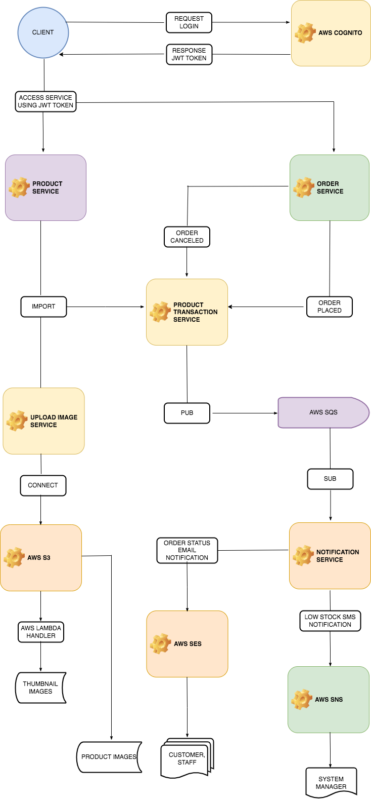
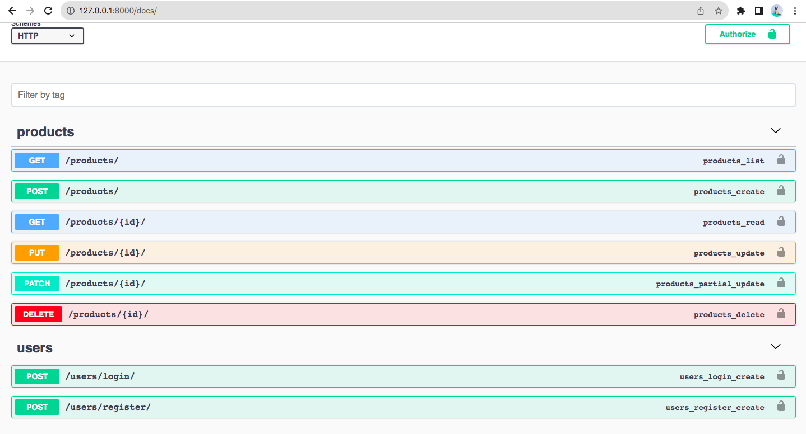
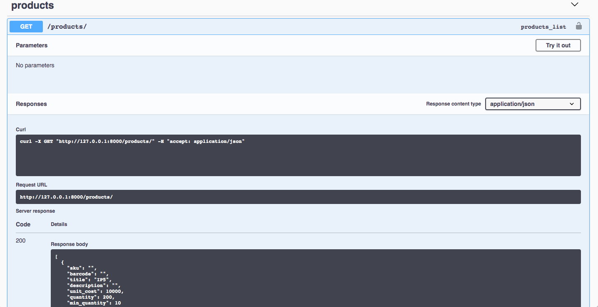
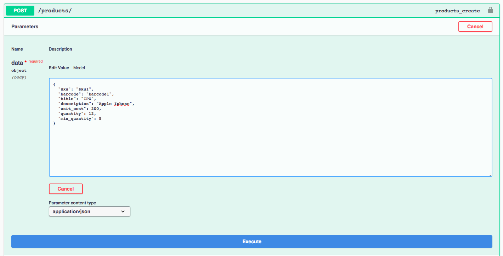
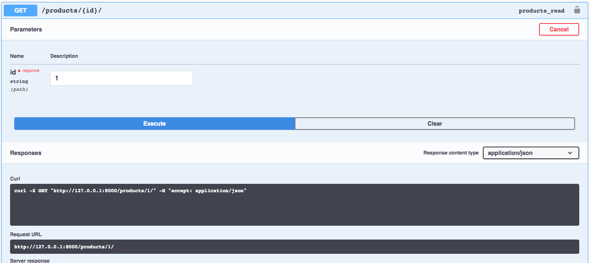
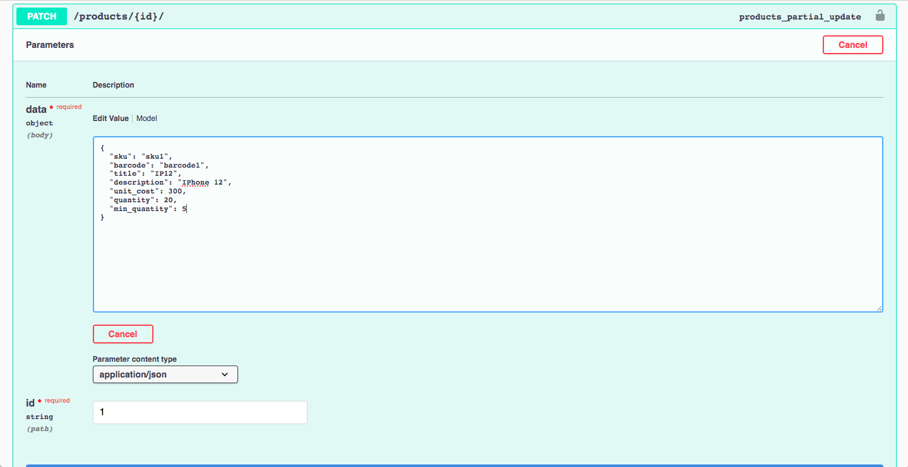
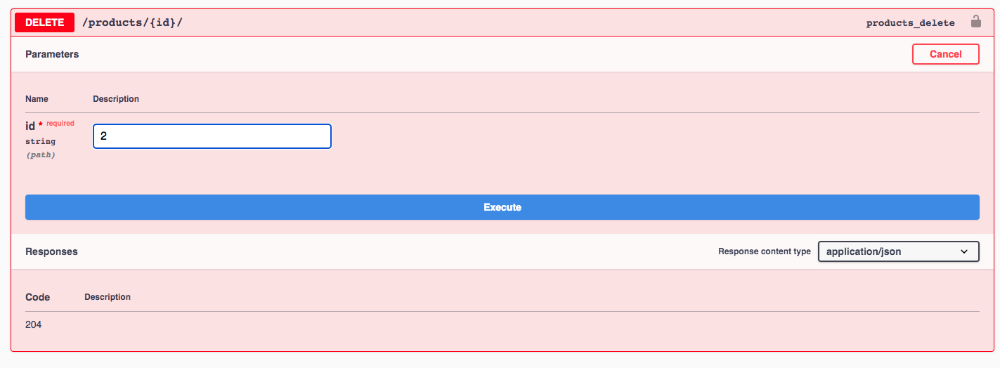

# Inventory workflow



## Prerequisites
- Python 3.6+
- Virtualenv


## virtualenv

```bash
# 1. Create virtual env
cd api
python3 -m venv virtualenv
. virtualenv/bin/activate

# 2. Install dependency
pip install -r requirements/local.txt
./manage.py migrate

# 3. Migrate database
$ ./manage.py migrate


# 4. Init master data(Default admin information: admin@admin.com/123456@aA)
python manage.py seed_users

# 5. Start server
$ ./manage.py runserver 0.0.0.0:8000
```

## Django Admin
- URL: http://localhost/admin

## Swagger Document
- URL: http://localhost/docs

## API Authentication
- SIMPLE_JWT support by Django rest api library
- Django_cognito_jwt


# Product CRUD screenshot














C1
C2
C3
